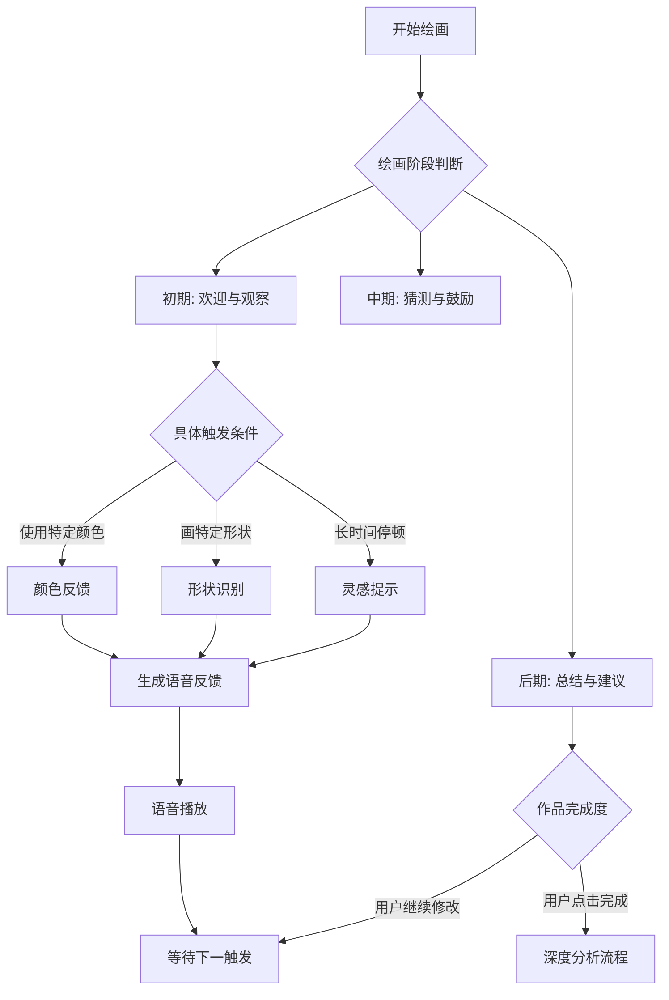

# **绘梦精灵 (DreamWeaver AI) - 儿童多感官创造力启发系统 PRD v3.0**

## **🎯 项目摘要**

| 项目维度     | 详细说明                                                                |
| -------- | ------------------------------------------------------------------- |
| **项目名称** | 绘梦精灵 (DreamWeaver AI)                                               |
| **项目定位** | 基于多模态大模型的儿童创造力启发与情感陪伴系统，聚焦"AI+公益"赋能教育公平                             |
| **核心价值** | 通过"视觉-听觉-动态影像"全感官反馈，帮助孩子（尤其资源匮乏地区及特殊儿童）跨越表达障碍，实现从"被动绘画"到"主动创作故事"的转变 |
| **目标用户** | 乡村/偏远地区儿童、孤独症谱系儿童、学龄前及小学低年级学生                                       |
| **技术平台** | Streamlit（快速原型）+ ModelScope魔搭生态 + 多模态AI API +coze 集成                       |
| **比赛契合** | 100%契合"小有可为"公益黑客松主题，解决真实教育痛点                                        |

-----
两个主体：
1.对已有图画的解析，（1.音乐生成与情感点评，（2.生成进一步的动画视频片段；均为coze工作流实现
2.互动画板，用户可以在画板上绘制，与AI互动，实现实时反馈与创作；也支持可生成音乐/视频。
---

## **🔧 二、产品功能矩阵 - 四层架构设计**

### **2.1 用户旅程地图（完整体验流）**

```
                  ┌──────────────┐
                  │  发现入口     │
                  │  (学校/推荐)  │
                  └──────┬───────┘
                         ▼
                  ┌──────────────┐
                  │  初次引导     │
                  │ (固定语音欢迎)   │
                  └──────┬───────┘
                         ▼
    ┌──────────────┬─────┴────────────┐
    │              │                  │
    ▼              ▼                  ▼
┌──────┐      ┌───── ─┐           ┌──────┐
│自由绘画│     │主题挑战│         │故事续写│
│(探索期)│     │(任务式)│         │(创意) │
└───┬───┘     └───┬───┘          └───┬───┘
    │             │                  │      
    └─────────────┼──────────────── ─┘
                ▼                   ▼
            ┌────────────┐    ┌───────────┐
            │  实时反馈   │    │  深度创作   │
            │(边画边聊)   │    │(作品加工)   │
            └──────┬─────┘    └──────┬────┘
                   │                   │
                   └─────────┬─────────┘
                             ▼
                      ┌──────────────┐
                      │  成果展示    │
                      │(多媒体作品) │
                      └──────┬───────┘
                             ▼
                      ┌──────────────┐
                      │  分享传播    │
                      │(家庭/社区)   │
                      └──────────────┘
```

### **2.2 核心模块一：智能画板系统 ✏️**

#### **2.2.1 画板基础功能规格**

| 功能项      | 详细规格                        | 技术实现         | 用户体验目标      |
| -------- | --------------------------- | ------------ | ----------- |
| **画布区域** | 800×600px（默认），可缩放           | HTML5 Canvas | 接近真实纸张的绘画感  |
| **画笔工具** | 6种粗细（1-10px），3种类型（圆头/方头/喷枪） | Canvas API   | 满足不同年龄精细度需求 |
| **颜色选择** | 24色预设色盘 + RGB取色器            | 颜色选择组件       | 色彩认知教育的一部分  |
| **辅助工具** | 橡皮擦、撤销(10步)、重做、清空           | 状态管理         | 降低犯错焦虑，鼓励尝试 |
| **图层支持** | 基础图层（背景）、绘画图层               | 分层渲染         | 为高级功能预留     |
| **触摸优化** | 支持平板触摸压力感应                  | 触摸事件监听       | 移动设备友好      |

#### **2.2.2 数据采集系统（AI分析基础）**

| 数据类型     | 采集频率        | 存储格式    | AI应用场景      |
| -------- | ----------- | ------- | ----------- |
| **笔触数据** | 每笔记录        | JSON时序  | 分析绘画顺序和思考过程 |
| **截图数据** | 每8秒/每8笔自动截取 | PNG格式   | 实时画面理解      |
| **操作日志** | 每个动作记录      | 结构化日志   | 分析犹豫、修改等行为  |
| **时间戳**  | 毫秒级记录       | Unix时间戳 | 分析绘画节奏和专注度  |


### **2.3 核心模块二：AI小精灵系统 🧚**

#### **2.3.1 小精灵人格化设计（初步）**

精灵人格：设定为一个“调皮但博学”的小精灵，它不会直接教怎么画，而是会吐槽（“哎呀，你这个苹果怎么像个土豆？”）或者猜测（“你是想给这只小狗画一个超级英雄斗篷吗？”）。 


#### **2.3.2 实时交互逻辑 - 状态机设计（初期提示词完成，流程为示例）**



#### **2.3.3 语音交互方案对比（选择单向语音）**

| 方案           | 技术复杂度 | 用户体验 | 适用场景 | 比赛推荐  |
| ------------ | ----- | ---- | ---- | ----- |
| **单向语音**     | 低     | 较好   | 基础反馈 | MVP版本 |


**方案详解 - 单向语音(画笔次数调用)**：

```
交互流程：
1. 界面始终画板界面
2. 孩子画了预定笔画 → 发送笔画记录及画面
3. qwen-omini-flash分析 → 生成语音回答 → 播放语音
4. 无需额外按钮，适合儿童操作

技术栈：
- 语音采集：无
- 语音识别：无
- 语音合成：OpenAI TTS（child声线）/Qwen-Omini/doubao
- 
```


#### **2.3.4 反馈类型库（预制+动态生成）（系统提示词完成）**

| 反馈类型     | 触发条件   | 示例话术            |
| -------- | ------ | --------------- | 
| **观察描述** | 新元素出现  | "我看到你画了一个红色的圆圈" | 
| **情感共鸣** | 使用温暖色调 | "这个黄色让画面很温暖"    | 
| **创意猜测** | 未完成图形  | "这是要画一只小兔子吗？"   | 
| **技术建议** | 构图不平衡  | "左边有点空，要不要加朵云？" | 
| **故事引导** | 多个元素   | "这只小鸟要飞去哪里呀？"   | 
| **幽默互动** | 抽象图形   | "这个像不像吃了太多的西瓜？" | 

**Prompt工程示例**：

```python
def generate_feedback_prompt(screenshot_analysis, drawing_history):
    """生成小精灵反馈的Prompt，模型使用阿里的qwen-omini-flash"""
    prompt = f"""
    你是一个5岁孩子的绘画陪伴小精灵，名字叫"球球"。

    分析绘画作品内涵，考虑孩子的年龄和绘画能力。

    绘画过程特征：
    - 绘画时长：{drawing_history.duration}分钟
    - 修改次数：{drawing_history.revision_count}
    - 当前阶段：{drawing_history.stage}

    生成一条反馈，要求：
    1. 使用5-8岁儿童能理解的语言
    2. 长度不超过20字
    3. 包含一个观察 + 一个开放式问题
    4. 语气亲切自然，像朋友聊天

    反馈："""
    return prompt
```

### **2.4 核心模块三：作品工坊系统 🎬**

#### **2.4.1 多模态解析引擎 - 五维分析（示例-实际一次模型调用完成）**

```python
# 解析引擎架构
class MultiModalAnalyzer:
    def __init__(self):
        self.vision_model = "Qwen-VL-Chat"
        self.llm_model = "Qwen2.5-7B-Chat"

    def analyze_drawing(self, image_path):
        """五维度深度分析"""
        analysis = {
            "theme_analysis": self._analyze_theme(image_path),
            "color_analysis": self._analyze_colors(image_path),
            "composition_analysis": self._analyze_composition(image_path),
            "emotional_analysis": self._analyze_emotion(image_path),
            "developmental_analysis": self._analyze_development(image_path)
        }
        return self._format_report(analysis)

    def _analyze_theme(self, image_path):
        """主题识别 - 理解孩子在画什么"""
        prompt = """识别这幅儿童画的主题和主要元素。注意儿童绘画特点：
        1. 可能使用象征性表达（圆圈代表人脸）
        2. 比例可能夸张（太阳比房子大）
        3. 可能有想象元素（会飞的鱼）

        返回JSON格式：{
            "main_theme": "主题描述",
            "elements": ["元素1", "元素2", ...],
            "story_hint": "可能的故事线索"
        }"""
        return call_vision_model(image_path, prompt)

    def _analyze_colors(self, image_path):
        """色彩分析 - 心理与教育意义"""
        # 提取主色调
        dominant_colors = extract_dominant_colors(image_path)

        # 色彩心理学映射
        color_psychology = {
            "红色": ["热情", "活力", "警告"],
            "蓝色": ["平静", "思考", "忧郁"],
            "黄色": ["快乐", "创意", "不安"],
            "绿色": ["自然", "平衡", "成长"]
        }

        return {
            "dominant_colors": dominant_colors,
            "color_psychology": color_psychology,
            "color_balance": self._assess_color_balance(dominant_colors)
        }

    def _analyze_composition(self, image_path):
        """构图分析 - 艺术启蒙"""
        composition_rules = [
            "三分法构图", "对称构图", "中心构图",
            "对角线构图", "框架构图"
        ]

        # 使用CLIP评估构图类型
        best_match = clip_match_composition(image_path, composition_rules)

        return {
            "composition_type": best_match,
            "balance_score": self._calculate_balance(image_path),
            "focus_point": self._detect_focus(image_path),
            "suggestions": self._generate_composition_suggestions(best_match)
        }

    def _analyze_emotion(self, image_path):
        """情感分析 - 通过画作理解孩子内心"""
        emotion_prompt = """分析这幅儿童画表达的情感。
        考虑以下维度：
        1. 色彩选择（明亮/暗淡）
        2. 线条特征（流畅/断续）
        3. 画面密度（密集/稀疏）
        4. 主题倾向（现实/幻想）

        情感标签：[快乐, 悲伤, 愤怒, 恐惧, 平静, 兴奋, 孤独, 友爱]"""

        return call_vision_model(image_path, emotion_prompt)

    def _analyze_development(self, image_path):
        """发展阶段评估 - 教育价值核心"""
        # 基于儿童绘画发展阶段理论
        development_stages = {
            "涂鸦期": "2-4岁，无意识线条",
            "象征期": "4-7岁，能命名所画图形", 
            "图示期": "7-9岁，开始有空间概念",
            "写实期": "9岁以上，追求真实表现"
        }

        stage = self._classify_development_stage(image_path)
        return {
            "stage": stage,
            "age_range": development_stages[stage],
            "milestones": self._identify_milestones(image_path, stage),
            "suggestions": self._generate_development_suggestions(stage)
        }
```

#### **2.4.2 音乐生成系统 - 从视觉到听觉的映射（二次提示词模型）**

**完整音乐生成流程**：（使用oze工作流）
--coze工作流实现，从图片上传到返回的音乐链接

#### **2.4.3 视频生成系统 - 首尾帧魔法动画**

| 动画类型     | 适用场景  | 技术实现  | 时长    |
| -------- | ----- | ----- | ----- |
| **平滑过渡** | 一般作品  | 首尾帧渐变 | 3-5秒  |
| **元素生长** | 植物/建筑 | 逐元素出现 | 5-8秒  |
| **故事演绎** | 叙事性画  | 多帧动画  | 8-12秒 |
| **特效增强** | 幻想主题  | 添加光效  | 3-5秒  |

**火山引擎视频生成配置**：
参考：
```python
def create_magic_transition(original_image, enhanced_image, style="fantasy"):
    """创建魔法过渡视频"""

    # 根据风格选择不同提示词
    style_prompts = {
        "fantasy": "魔法光效，星星点点，梦幻过渡",
        "cartoon": "卡通动画，弹性效果，活泼过渡",
        "watercolor": "水彩晕染，柔和渐变，艺术过渡",
        "simple": "平滑渐变，简单优雅"
    }

    video_task = huoshan_video_generate(
        model="doubao-seedance-1-0-pro-fast-251015",  # 推荐模型
        images=[
            {"url": original_image, "role": "first_frame"},
            {"url": enhanced_image, "role": "last_frame"}
        ],
        prompt=style_prompts[style],
        duration=8,  # 8秒适中
        resolution="720p",
        ratio="4:3",  # 适合绘画比例
        generate_audio=False,  # 后续合成音乐
        watermark=False,
        service_tier="flex"  # 离线推理，成本减半
    )

    return video_task
```

#### **2.4.4 AI点评生成 （coze工作流实现）**
#### 实现从图片上传到返回点评音频链接


---

## **⚙️ 三、技术架构与实现方案**

### **3.2 Streamlit应用详细架构**

```
dreamweaver-ai/
├── 📁 .streamlit/                    # Streamlit配置
│   ├── config.toml                  # 应用配置
│   └── secrets.toml                 # API密钥（不提交）
│
├── 📁 src/                          # 源代码
│   ├── app.py                       # 主应用入口
│   │
│   ├── 📁 pages/                    # 多页面应用
│   │   ├── 2_🎨_智能画板.py         # 主绘画页面/互动陪伴
│   │   ├── 3_🧚_加工工厂.py         # 作品加工页面（已有图片转换音乐和图片/视频）
│   │   ├── 1_🎬_应用首页.py         # 应用首页，介绍两种工作方式。
│   │   └── 5_⚙️_设置中心.py         # 设置页面
│   │
│   ├── 📁 components/               # 可复用组件
│   │   ├── drawing_canvas.py        # 自定义画板组件，可画画，可截图，可记录绘画笔画
│   │   ├── voice_interaction.py     # 画板信息更新组件，记数笔画，记录绘画区域/笔画区，截图画板
│   │   ├── music_player.py          # 音乐播放器
│   │   ├── video_player.py          # 视频播放器
│   │   └── progress_tracker.py      # 进度跟踪组件
│   │
│   ├── 📁 services/                 # 业务服务层
│   │   ├── drawing_service.py       # 绘画相关服务（火山引擎，首尾帧/首帧）
│   │   ├── multimodal_service.py    # 多模态分析服务（qwen3-omini-flash实现，通过提示词设置+画板图片）
│   │   ├── music_service.py         # 已有图片转音乐生成服务（coze完整工作流实现）
│   │   ├── video_service.py         # 视频生成服务（coze,预留工作流id，实现文件id到视频）
│   │   ├── voice_service.py         # 语音交互服务（qwen3-omini-flash实现）
│   │
│   ├── 📁 models/                   # 数据模型
│   │   ├── drawing_model.py         # 绘画数据模型
│   │   ├── artwork_model.py         # 作品模型
│   │   └── analysis_model.py        # 分析结果模型
│   │
│   ├── 📁 utils/                    # 工具函数
│   │   ├── session_manager.py       # 会话状态管理
│   │   ├── file_handler.py          # 文件处理/上传/下载
│   │   ├── image_processor.py       # 图像处理工具
│   │   ├── audio_processor.py       # 音频处理工具
│   │   └── config_loader.py         # 配置加载
│   │
│   └── 📁 assets/                   # 静态资源
│       ├── css/                     # 样式文件
│       ├── js/                      # JavaScript文件
│       ├── images/                  # 图片资源
│       ├── sounds/                  # 音效资源
│       └── fonts/                   # 字体文件
│
├── 📁 data/                         # 数据存储
│   ├── artworks/                    # 作品存储
│   ├── analytics/                   # 分析数据
│   └── cache/                       # 缓存数据
│
├── 📁 docs/                         # 文档
│   ├── api_docs.md                  # API文档
│   ├── deployment.md                # 部署指南
│   └── user_manual.md               # 用户手册
│
├── requirements.txt                 # Python依赖
├── README.md                        # 项目说明
└── .env.example                     # 环境变量示例
```

### **3.3 关键API集成方案**

#### **3.3.1 多模态视觉理解API（后期规划，和前期无关）**

```python
# 视觉服务抽象层 - 支持多模型切换
class VisionService:
    def __init__(self, provider="qwen"):
        self.provider = provider
        self.models = {
            "qwen": "qwen-vl-chat",
            "openai": "gpt-4-vision-preview",
            "gemini": "gemini-pro-vision"
        }

    def analyze_image(self, image_data, prompt):
        """通用图像分析接口"""
        if self.provider == "qwen":
            return self._call_qwen_vl(image_data, prompt)
        elif self.provider == "openai":
            return self._call_gpt4v(image_data, prompt)
        elif self.provider == "gemini":
            return self._call_gemini(image_data, prompt)

    def _call_qwen_vl(self, image_data, prompt):
        """调用Qwen-VL（国产优先，成本低）"""
        # Base64编码图片
        import base64
        base64_image = base64.b64encode(image_data).decode('utf-8')

        # 构建请求
        messages = [
            {
                "role": "user",
                "content": [
                    {"type": "image", "image": base64_image},
                    {"type": "text", "text": prompt}
                ]
            }
        ]

        # 调用DashScope API
        from dashscope import MultiModalConversation
        response = MultiModalConversation.call(
            model='qwen-vl-chat',
            messages=messages,
            api_key=os.getenv('DASHSCOPE_API_KEY')
        )

        return response.output.choices[0].message.content[0]['text']
```

#### **3.3.2 语音交互API集成**
#### 使用阿里qwen3-omni-flash-2025-12-01 模型

```python
图片+文本输入
Qwen-Omni 模型支持传入多张图片。对输入图片的要求如下：

单个图片文件的大小不超过10 MB;

图片数量受模型图文总 Token 上限（即最大输入）的限制，所有图片的总 Token 数必须小于模型的最大输入;

图片的宽度和高度均应大于10像素，宽高比不应超过200:1或1:200；

支持的图片类型请参见视觉理解。

以下示例代码以传入图片公网 URL 为例，传入本地图片请参见：输入 Base64 编码的本地文件。当前只支持以流式输出的方式进行调用。

OpenAI 兼容
PythonNode.jscurl

 
import os
from openai import OpenAI

client = OpenAI(
    # 若没有配置环境变量，请用阿里云百炼API Key将下行替换为：api_key="sk-xxx",
    # 新加坡和北京地域的API Key不同。获取API Key：https://help.aliyun.com/zh/model-studio/get-api-key
    api_key=os.getenv("DASHSCOPE_API_KEY"),
    # 以下是北京地域base_url，如果使用新加坡地域的模型，需要将base_url替换为：https://dashscope-intl.aliyuncs.com/compatible-mode/v1
    base_url="https://dashscope.aliyuncs.com/compatible-mode/v1",
)

completion = client.chat.completions.create(
    model="qwen3-omni-flash", # 模型为Qwen3-Omni-Flash时，请在非思考模式下运行
    messages=[
        {
            "role": "user",
            "content": [
                {
                    "type": "image_url",
                    "image_url": {
                        "url": "https://help-static-aliyun-doc.aliyuncs.com/file-manage-files/zh-CN/20241022/emyrja/dog_and_girl.jpeg"
                    },
                },
                {"type": "text", "text": "图中描绘的是什么景象？"},
            ],
        },
    ],
    # 设置输出数据的模态，当前支持两种：["text","audio"]、["text"]
    modalities=["text", "audio"],
    audio={"voice": "Cherry", "format": "wav"},
    # stream 必须设置为 True，否则会报错
    stream=True,
    stream_options={
        "include_usage": True
    }
)

for chunk in completion:
    if chunk.choices:
        print(chunk.choices[0].delta)
    else:
        print(chunk.usage)
```
#### **3.3.3 图片转音乐生成API - coze工作流集成调用**
**coze工作流调用** 

workflow_id=7601786439168229386
#### 说明：
- 该工作流用于将图片转换为音乐。
- 输入参数：
  - `img`: 图片文件（先通过文件上传方式上传图片，获取文件代号后使用file.id 指定文件）
- 输出参数：
  - `music`: 生成的音乐文件（Base64编码）


#### **3.3.4 视频生成API - 火山引擎集成**

```python
class VideoGenerationService:
    """视频生成服务 - 火山引擎集成"""

    def __init__(self):
        self.default_model = "doubao-seedance-1-0-pro-fast-251015"
        self.fallback_model = "doubao-seedance-1-0-lite-t2v-250428"  # 文生视频备用

    def create_transition_video(self, first_frame, last_frame, config=None):
        """
        创建首尾帧过渡视频

        Args:
            first_frame: 首帧图片URL或Base64
            last_frame: 尾帧图片URL或Base64
            config: 视频配置参数

        Returns:
            视频任务ID和状态
        """
        if config is None:
            config = self._default_config()

        try:
            # 创建视频生成任务
            task_response = huoshan_video_generate(
                model=self.default_model,
                images=[
                    {"url": first_frame, "role": "first_frame"},
                    {"url": last_frame, "role": "last_frame"}
                ],
                prompt=config.get("prompt", "平滑过渡动画"),
                duration=config.get("duration", 8),
                resolution=config.get("resolution", "720p"),
                ratio=config.get("ratio", "4:3"),
                generate_audio=False,  # 单独处理音频
                watermark=False,
                service_tier=config.get("service_tier", "flex")  # 离线推理降成本
            )

            return {
                "task_id": task_response.get("task_id"),
                "status": "processing",
                "estimated_time": 60  # 估计60秒完成
            }

        except Exception as e:
            # 降级方案：生成简单过渡效果
            return self._create_simple_transition(first_frame, last_frame)

    def _default_config(self):
        """默认视频配置"""
        return {
            "duration": 8,  # 8秒
            "resolution": "720p",
            "ratio": "4:3",
            "prompt": "平滑过渡动画，添加魔法光效效果",
            "service_tier": "flex",  # 离线推理，成本减半
            "return_last_frame": False
        }

    def query_video_task(self, task_id):
        """查询视频任务状态"""
        try:
            status_response = query_video_task(task_id=task_id)
            return status_response
        except:
            return {"status": "unknown", "progress": 0}
```

### **3.4 核心技术难点与解决方案**

#### **难点一：Streamlit实时画板性能优化**

**问题**：Streamlit每次交互都会重载页面，画板数据会丢失。

**解决方案**：

1. **使用session_state持久化数据**：
   
   ```python
   # 在session_state中存储画板数据
   if 'drawing_data' not in st.session_state:
    st.session_state.drawing_data = {
        'strokes': [],
        'current_canvas': None,
        'undo_stack': [],
        'redo_stack': []
    }
   ```

2. **自定义画板组件避免重载**：
   
   ```python
   # 使用streamlit-component开发自定义画板
   import streamlit.components.v1 as components
   
   ```

# 创建自定义画板组件

drawing_component = components.declare_component(
    "drawing_canvas",
    url="http://localhost:3000"  # 独立运行的React画板
)

# 在Streamlit中使用

canvas_data = drawing_component(key="canvas")

```

3. **增量更新策略**：
```python
# 只更新变化的部分，而不是整个画布
def update_canvas_incrementally(new_stroke):
    # 仅添加新笔触，而不是重绘全部
    st.session_state.drawing_data['strokes'].append(new_stroke)
    # 触发部分重绘
    st.rerun(scope="canvas_only")
```

#### **难点二：多API异步调用与错误处理**

**问题**：视频生成、音乐生成等API调用时间长，需要异步处理。

**解决方案**：

1. **异步任务队列设计**：
   

2. **进度反馈机制**：

# 使用Streamlit的进度条和状态指示器
progress_bar = st.progress(0)
status_text = st.empty()

# 更新进度
for i in range(100):
    progress_bar.progress(i + 1)
    status_text.text(f"正在生成音乐... {i+1}%")
    await asyncio.sleep(0.1)  # 模拟耗时操作
```

3. **降级策略金字塔**：
   
---

## **🎨 四、用户体验与交互设计**

### **4.1 视觉设计系统**

#### **4.1.1 色彩系统 - 儿童友好配色**

| 色彩角色    | 色值             | 使用场景     | 心理效应  |
| ------- | -------------- | -------- | ----- |
| **主色**  | `#4A90E2`（科技蓝） | 按钮、重要元素  | 信任、智慧 |
| **辅色**  | `#FF6B6B`（温暖红） | 小精灵、互动元素 | 活力、亲切 |
| **背景色** | `#F8F9FA`（柔白）  | 画布背景     | 专注、舒适 |
| **成功色** | `#52C41A`（生机绿） | 完成状态     | 成长、积极 |
| **提示色** | `#FAAD14`（阳光黄） | 提示、通知    | 注意、温暖 |
| **文字色** | `#262626`（深灰）  | 主要文字     | 清晰、易读 |

#### **4.1.2 字体系统**

| 字体类型     | 字体族                   | 大小范围    | 使用场景     |
| -------- | --------------------- | ------- | -------- |
| **标题字体** | "Ma Shan Zheng"（手写体）  | 24-32px | 页面标题、大按钮 |
| **正文字体** | "ZCOOL XiaoWei"（楷体变体） | 16-20px | 说明文字、对话  |
| **辅助字体** | "Noto Sans SC"（无衬线）   | 12-14px | 标签、小字    |

#### **4.1.3 图标系统**

| 图标类别     | 风格    | 示例    | 使用规范      |
| -------- | ----- | ----- | --------- |
| **工具图标** | 线性，填充 | 画笔、橡皮 | 功能明确，高对比度 |
| **状态图标** | 面性，彩色 | 加载、完成 | 状态清晰，动画反馈 |
| **成就图标** | 面性，渐变 | 徽章、奖杯 | 视觉突出，有成就感 |
| **交互图标** | 线性，动态 | 语音按钮  | 点击反馈，状态变化 |

### **4.2 交互设计细节**

#### **4.2.1 画板交互优化**

```javascript
// 画板交互优化示例
const canvasOptimizations = {
  // 1. 触摸优化
  touchSupport: {
    touchAction: 'none',  // 阻止浏览器默认触摸行为
    passive: false,       // 允许preventDefault
    multiTouch: true      // 支持多点触控（未来扩展）
  },

  // 2. 笔迹预测（减少延迟）
  strokePrediction: {
    enable: true,
    algorithm: 'quadratic-bezier',  // 使用贝塞尔曲线预测
    lookAhead: 3,                   // 预测3个点
    smoothing: 0.5                  // 平滑系数
  },

  // 3. 性能优化
  performance: {
    renderThreshold: 1000,  // 超过1000个笔触时启用优化
    incrementalRender: true, // 增量渲染
    lazyRedraw: true         // 延迟重绘
  },

  // 4. 儿童友好调整
  childFriendly: {
    targetSize: 20,     // 目标点击区域大小（px）
    undoConfirm: true,  // 撤销前确认（防止误操作）
    autoSave: 30000     // 每30秒自动保存
  }
};
```


#### **4.2.3 加载状态与反馈设计**

| 操作类型     | 预计时长   | 加载状态设计              | 用户反馈       |
| -------- | ------ | ------------------- | ---------- |
| **实时分析** | 1-3秒   | 小精灵思考动画 + "正在思考..." | 即时反馈，可接受   |
| **音乐生成** | 10-30秒 | 进度条 + 音乐符号动画        | 提前告知预计时间   |
| **视频生成** | 30-60秒 | 分阶段进度 + 预览图         | 允许用户继续其他操作 |
| **首次加载** | 3-5秒   | 启动动画 + 趣味提示语        | 营造期待感      |

```python
def show_loading_state(operation, estimated_time):
    """显示加载状态"""

    loading_templates = {
        "analyzing": {
            "message": "小精灵正在观察你的画...",
            "animation": "thinking",
            "placeholder": "分析结果将很快显示"
        },
        "music_generating": {
            "message": "正在为你的画创作音乐...",
            "animation": "music_notes",
            "progress_bar": True
        },
        "video_generating": {
            "message": "魔法变身中...",
            "animation": "sparkles",
            "stages": ["准备", "生成", "合成"],
            "estimated_time": estimated_time
        }
    }

    template = loading_templates.get(operation, {})

    # 显示加载界面
    with st.container():
        st.markdown(f"### {template['message']}")

        if "animation" in template:
            # 显示加载动画
            st_lottie(load_lottie_animation(template['animation']))

        if "progress_bar" in template:
            # 显示进度条
            progress_bar = st.progress(0)
            for i in range(100):
                progress_bar.progress(i + 1)
                time.sleep(estimated_time / 100)

        if "stages" in template:
            # 显示分阶段进度
            for stage in template["stages"]:
                with st.spinner(f"{stage}..."):
                    time.sleep(estimated_time / len(template["stages"]))

    return True
```

### **4.3 无障碍设计考虑**

#### **4.3.1 视觉无障碍**

| 需求        | 实现方案          | 技术实现    |
| --------- | ------------- | ------- |
| **色盲友好**  | 避免红绿对比，提供色盲模式 | 色彩映射算法  |
| **低视力支持** | 大字体模式，高对比度主题  | CSS变量切换 |
| **阅读障碍**  | 字体选择，行高调整     | 用户设置保存  |

#### **4.3.2 操作无障碍**

| 需求       | 实现方案        | 技术实现    |
| -------- | ----------- | ------- |
| **键盘导航** | 所有功能支持键盘操作  | Tab索引管理 |
| **语音控制** | 关键功能支持语音指令  | 语音识别扩展  |
| **简化模式** | 为特殊儿童提供简化界面 | 界面复杂度开关 |

#### **4.3.3 特殊儿童适配**

```python
class AccessibilityAdapter:
    """无障碍适配器"""

    def __init__(self, user_profile):
        self.profile = user_profile
        self.adaptations = self._load_adaptations()

    def adapt_interface(self, base_interface):
        """根据用户需求适配界面"""

        adapted = base_interface.copy()

        # 自闭症谱系儿童适配
        if self.profile.get("autism_spectrum"):
            adapted = self._adapt_for_autism(adapted)

        # 注意力缺陷适配
        if self.profile.get("adhd"):
            adapted = self._adapt_for_adhd(adapted)

        # 运动障碍适配
        if self.profile.get("motor_disability"):
            adapted = self._adapt_for_motor_disability(adapted)

        return adapted

    def _adapt_for_autism(self, interface):
        """为自闭症谱系儿童适配"""
        # 简化视觉刺激
        interface["max_colors"] = 5
        interface["animation_speed"] = "slow"
        interface["sound_effects"] = False

        # 增加可预测性
        interface["predictable_feedback"] = True
        interface["clear_transitions"] = True

        return interface

    def _adapt_for_adhd(self, interface):
        """为注意力缺陷儿童适配"""
        # 减少干扰元素
        interface["minimize_distractions"] = True
        interface["focus_mode"] = True

        # 增加即时反馈
        interface["instant_feedback"] = True
        interface["reward_frequency"] = "high"

        return interface

    def _adapt_for_motor_disability(self, interface):
        """为运动障碍儿童适配"""
        # 增大点击区域
        interface["button_size"] = "large"
        interface["touch_targets"] = 48  # 48px最小点击区域

        # 简化操作
        interface["gesture_simplification"] = True
        interface["voice_control"] = True

        return interface
```


#### **5.3.2 技术资源**

| 资源类型      | 具体需求                         | 获取方式  | 成本               |
| --------- | ---------------------------- | ----- | ---------------- |
| **开发环境**  | Python 3.10+、Node.js（可选）     | 本地安装  | 免费               |
| **API服务** | OpenAI、火山引擎、Suno             | 注册申请  | 约$50（比赛期间）       |
| **部署平台**  | Hugging Face Spaces / Vercel | 免费额度  | 免费               |
| **测试设备**  | 平板、手机、不同浏览器                  | 自有/借用 | 免费 |


## **📦 七、项目说明材料规划**

### **7.1 代码仓库结构优化**

```
dreamweaver-ai/
├── 📖 README.md                      # 项目总览（含演示链接）
├── 📁 docs/                         # 详细文档
│   ├── 📄 PRD_详细版.pdf            # 本PRD导出
│   ├── 📄 技术架构说明书.md
│   ├── 📄 API接口文档.md
│   ├── 📄 部署指南.md
│   ├── 📄 用户手册.pdf
│   └── 📁 presentations/            # 演示材料
│       ├── 🎬 demo_video.mp4        # 3分钟演示视频
│       ├── 📊 presentation.pptx     # 答辩PPT
│       └── 📝 speech_script.md      # 演讲脚本
│
├── 📁 src/                          # 源代码（如前所述）
├── 📁 tests/                        # 测试代码
│   ├── unit_tests/                  # 单元测试
│   ├── integration_tests/           # 集成测试
│   └── performance_tests/           # 性能测试
│
├── 📁 deployment/                   # 部署配置
│   ├── Dockerfile
│   ├── docker-compose.yml
│   ├── nginx.conf
│   └── cloudbuild.yaml
│
├── 📁 examples/                     # 示例文件
│   ├── sample_artworks/             # 示例画作
│   ├── sample_outputs/              # 示例输出
│   └── config_examples/             # 配置示例
│
├── requirements.txt                 # Python依赖
├── pyproject.toml                   # 项目配置
├── .gitignore                       # Git忽略
├── LICENSE                          # 开源协议
└── .env.example                     # 环境变量示例
```

---
